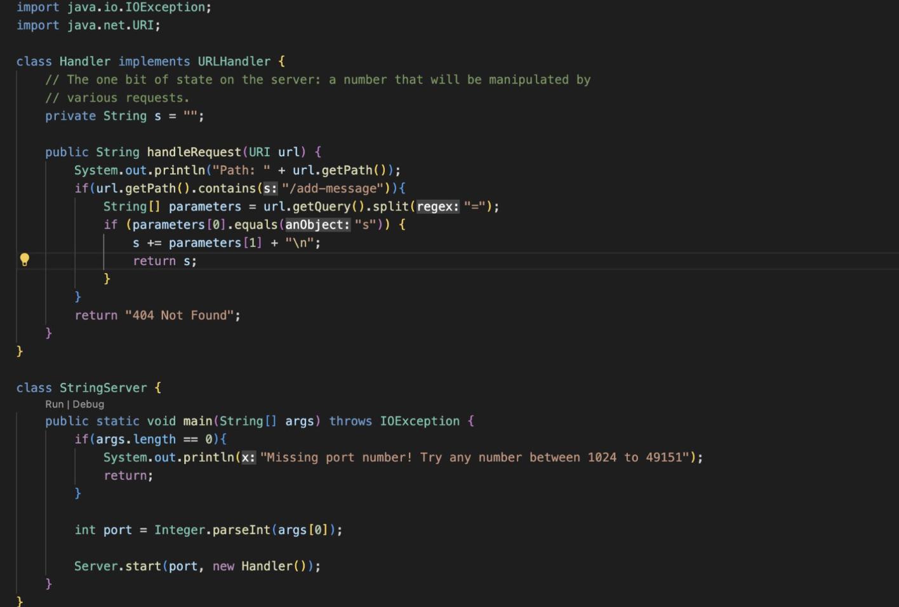
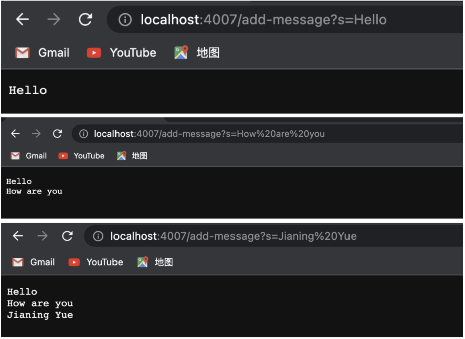
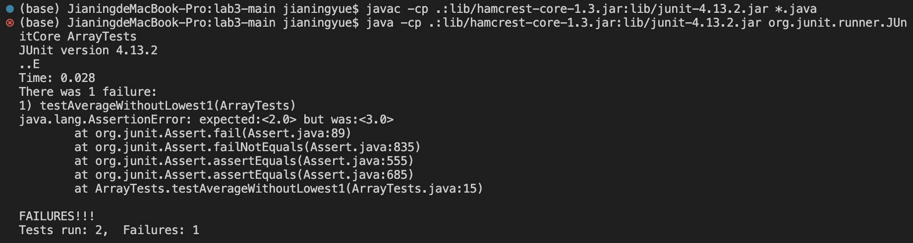
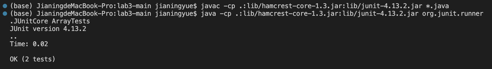

# Lab2

---

## Server and bugs 

---

## Part 1

---





> Which methods in your code are called?

```
url.getPath().equal()
url.getpath().contains()
url.getQuery().split()
Integer.parseInt()
start()
new Handler()
```

> What are the relevant arguments to those methods, and the values of any relevant fields of the class?

```
args
port
length
/
/add-message
=
s
str
```

> How do the values of any relevant fields of the class change from this specific request? If no values got changed, explain why.
---
We use `\n` to change the value of `str` everytime we add a new string to the server, the string will end the line and new string will start a new line.
so the values will change.

---
These are the meyhods called in my code, `getPath` will get the path of the url, if there is a `\` in the last and nothing followed, then the server will
return nothing in the beginning page, `url.getpath().contains()` will check the string after `\add-message`, if there is a string after it, `url.getQuery().split()`
will split the url. if `parameter[0] == s` then `parameter[1]` will add to the string `str` and return to the beginning page. if there is no string followed.
the server will return `404 Not Found`.

---
The `length` was called to chech the length of the string, if the length is `0`, it means there is no input, so the server can't start. if the
length is not `0`, then `Integer.parseInt()` will chang the value to integer. after this, `start()` will starts the server. And the server is called
with the integer `port` and `new Handler()` will creat a new handler as the parameter.


## Part 2

> A failure-inducing input for the buggy program, as a JUnit test and any associated code.

```
@Test
  public void testAverageWithoutLowest1(){
    double[] input1 = {1, 2, 4};
    assertEquals(2.0, ArrayExamples.averageWithoutLowest(input1), 0.01);
  }
```

> An input that doesn’t induce a failure, as a JUnit test and any associated code.

```
@Test
  public void testAverageWithoutLowest(){
    double[] input1 = {2};
    assertEquals(0.0, ArrayExamples.averageWithoutLowest(input1), 0.01);
  }
```

> The symptom, as the output of running the tests



> The bug, as the before-and-after code change required to fix it

```
static double averageWithoutLowest(double[] arr) {
    if(arr.length < 2) { return 0.0; }
    double lowest = arr[0];
    for(double num: arr) {
      if(num < lowest) { lowest = num; }
    }
    double sum = 0;
    for(double num: arr) {
      if(num != lowest) { sum += num; }
    }
    return sum / (arr.length - 1);
  }
```

```
static double averageWithoutLowest(double[] arr) {
    if(arr.length < 2) { return 0.0; }
    double lowest = arr[0];
    for(double num: arr) {
      if(num < lowest) { lowest = num; }
    }
    double sum = 0;
    for(double num: arr) {
      sum += num;
    }
    sum -= lowest; 
    return sum / (arr.length - 1);
  }
```

the test result after fixed the bug.



> Briefly describe why the fix addresses the issue.

The problem is the befor code only calculated the sum and lowest, so I added a calculation code to subtracts the lowest from the sum.

## Part 3

In the past two weeks we learned about the composition of URLs and practiced how to use Java code to create and use the server in lab
and we learned how to debug, create test file to test the bugs in java code. These are new knowledge. Before i learned it, i could only 
find bugs line by line frome the code and perform calculations with a pen, but now it's more easier for me to find the bugs.
